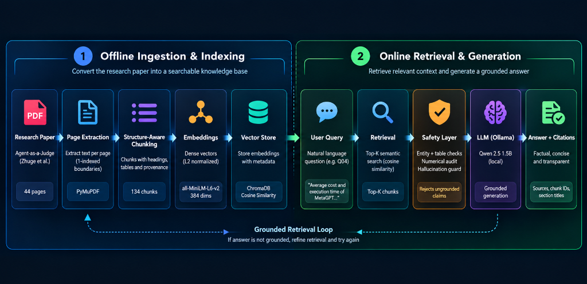

# RAG System Architecture & Workflow Visualization

This directory contains the visual architectural representation of the end-to-end Retrieval-Augmented Generation (RAG) system built for the Enverus Machine Learning & Gen-AI Case Study.

---

## Complete End-to-End RAG Architecture

---

## Architecture Flow Breakdown

The pipeline operates across two decoupled, reproducible execution phases:

### 1. Offline Document Ingestion & Indexing
1. **Source Research PDF:**
   - Input: `data/agent_as_a_judge.pdf` (Zhuge et al., 44 pages total).
2. **Page-Level Extraction (`src/ingest.py`):**
   - Uses PyMuPDF (`fitz`) to extract page records preserving exact 1-indexed document page boundaries.
3. **Structure-Aware Chunking (`src/chunking.py`):**
   - Deconstructs pages into 134 semantic chunks formatted as `chunk_p{page}_{index}`.
   - Detects section hierarchies, headers, and preserves Markdown tables intact (e.g., Table 1, Table 2, Table 3).
4. **Local Embedding Generation (`src/embeddings.py`):**
   - Employs `sentence-transformers/all-MiniLM-L6-v2` to compute 384-dimensional dense vectors.
   - L2 normalization is applied to enable standard cosine similarity.
5. **Persistent Vector Storage (`src/vector_store.py`):**
   - Stores chunk embeddings, text, and rich metadata in ChromaDB collection `agent_as_a_judge` with HNSW cosine distance indexing (`hnsw:space: "cosine"`).

### 2. Online Grounded Retrieval & Generation
6. **User Query Input:**
   - Validates non-empty input strings and query length bounds.
7. **Dense Semantic Retrieval (`src/retriever.py`):**
   - Embeds query and performs nearest-neighbor vector search in ChromaDB, returning top-$k$ chunks with cosine similarity score $s = 1 - d$.
8. **Deterministic Grounding & Numerical Safety Layer (`src/safety.py`):**
   - **Pre-Generation Entity Sufficiency:** Checks if required entity identifiers (e.g., `Task 51`, `Requirement R1`) are present in retrieved chunks; if missing, halts early (0.0s latency) with canonical insufficiency.
   - **Table-Context Disambiguation:** Prevents silent semantic metric substitution when general queries retrieve divergent tables (e.g. Table 2 vs Table 3).
   - **Post-Generation Numerical Audit:** Audits all percentages, runtimes, and dollar figures in candidate answers, rejecting unsupported numerical claims.
9. **Local LLM Generator (`src/generator.py` via Ollama):**
   - Prompts local `qwen2.5:1.5b` with temperature `0.0` and a strict 10-point anti-hallucination system prompt.
10. **Validated Grounded Response (`RAGResponse`):**
    - Outputs deterministic factual answer backed by explicit citation provenance (Rank, Chunk ID, Page, Section, Similarity Score, Latency).
